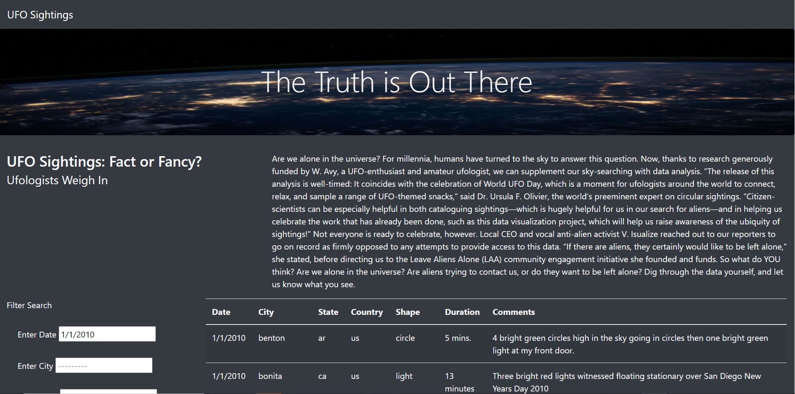
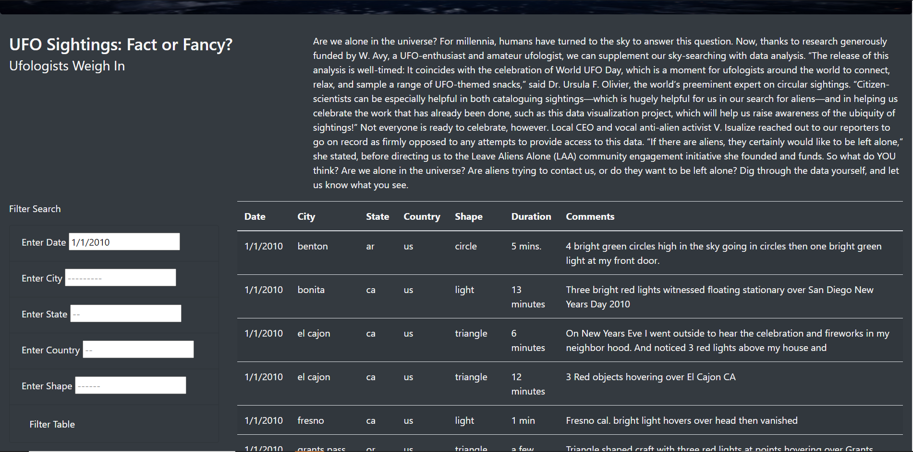

# UFOs

### Summary

The assignment focuses on building a html page on UFO observations. The UFO page takes a step further by providing filters for date, city, state, country and shape based on which the page displays the UFO observations. 

### Technology used

Javascript along with html was used to make this page. Links to bootstrap and d3 in the html script were used to personalize it. Additionally, the data was for this page was written in javascript. 

### Future development

To further develop this page, a drop down list could be added of all the available options since new users of this page may not be familiar with all the cities or states or etc. Therefore date can be an input box but shape, country, state and city could be a select box.
